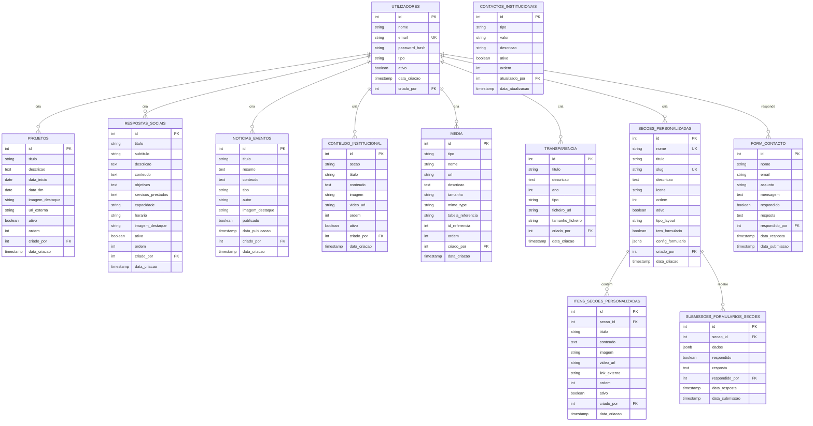

# Diagramas para o Relatório

## 1. Diagrama de Fluxo de Autenticação JWT


---

## 2. Diagrama da Arquitetura Cliente-Servidor


---

## 3. Diagrama Entidade-Relacionamento da Base de Dados



---

## 4. Diagrama de Arquitetura de Componentes React


---

## Como Usar Estes Diagramas

### Opção 1: Mermaid Live Editor

1. Acede a https://mermaid.live/
2. Cola o código de cada diagrama
3. Exporta como PNG ou SVG
4. Insere no relatório

### Opção 2: Markdown com suporte Mermaid

- GitHub, GitLab, Notion, Obsidian renderizam Mermaid automaticamente
- Copia o código diretamente para o teu documento

### Opção 3: VS Code

1. Instala a extensão "Markdown Preview Mermaid Support"
2. Abre este ficheiro em preview
3. Faz screenshot dos diagramas

### Opção 4: Exportar para imagem

```bash
# Instalar mermaid-cli
npm install -g @mermaid-js/mermaid-cli

# Converter para PNG
mmdc -i diagramas-relatorio.md -o diagrama1.png
```

---

## Personalização

Podes editar:

- **Cores**: Adiciona `style NOME fill:#COR` no final
- **Formas**: Retângulos `[]`, Cilindros `[()]`, Losangos `{}`
- **Setas**: `-->` (sólida), `-.->` (tracejada), `==>` (grossa)
- **Texto**: Quebra de linha com `<br/>`
